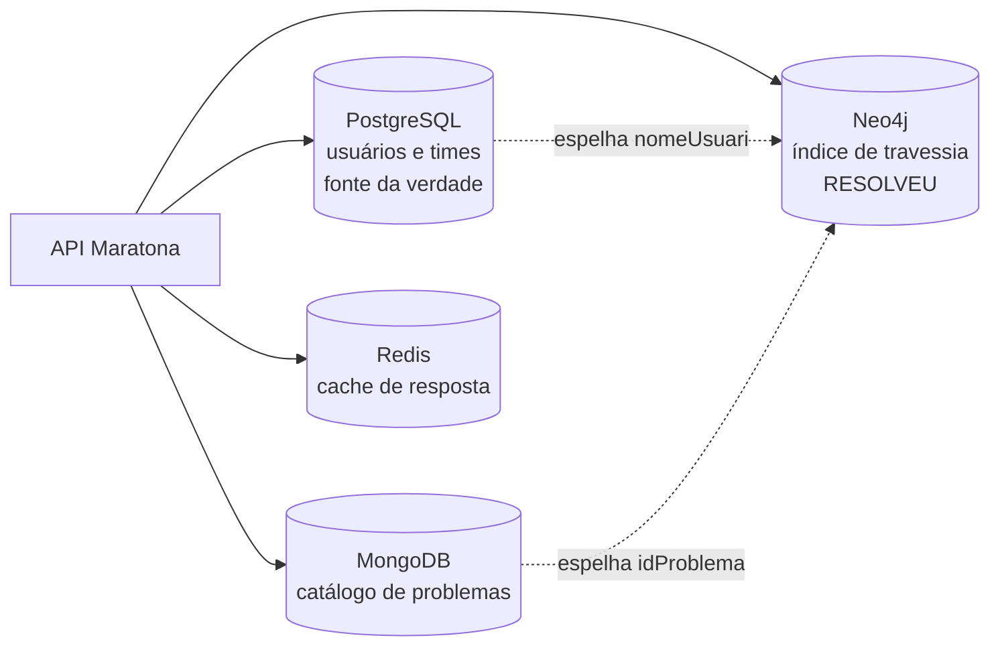

# Arquitetura

Este documento responde às perguntas que alguém faria ao olhar o projeto com desconfiança — por que quatro bancos, por que raspar HTML, por que não existe transação entre os stores. O formato é pergunta e resposta porque decisão de arquitetura é sempre *"por que X e não Y"*, e prosa corrida esconde isso atrás de palavras como "escalável".

Duas coisas antes de começar.

**Isto é uma prova de conceito.** O objetivo declarado era colocar conhecimento de arquitetura em prática, não sustentar tráfego real. Várias decisões só fazem sentido sob essa luz, e isso está dito onde é o caso.

**Algumas respostas são "não parei para pensar nisso".** Elas ficaram no texto de propósito. Uma justificativa inventada depois vale menos do que admitir onde a decisão foi tomada no susto — e a seção final lista o que já foi corrigido por causa destas perguntas.

---

## Persistência poliglota

### 1. Por que quatro bancos num projeto desse tamanho?

Porque a ideia era desenhar uma solução sob medida, e cada peça do problema tem uma forma diferente.

Num sistema com usuários que se relacionam entre si, é preciso garantir consistência — daí o **PostgreSQL** e as garantias ACID para tudo que envolve conta e time. Seria mais fácil colocar tudo num banco só, mas numa aplicação real, com milhares de requisições, é necessário separar o que é "perigoso" e precisa ser certeiro do que é apenas consulta simples.

O **MongoDB** entra como banco de leitura: o foco dele é devolver, dentro de uma lista imensa de exercícios, os detalhes de cada problema.

O **Neo4j** existe pela recomendação. Dava para fazer com inúmeros *joins*, mas isso não é eficiente — cada join custa tempo, e o número de problemas armazenados só cresce. Além disso, não é necessário garantir consistência forte ali: são consultas não fatais, que não dependem de exatidão no instante. E, no fim, as relações **são** um grafo.

O **Redis** é eficiência pura: imagine o tempo de montar a lista completa de problemas a cada requisição.

> **Contexto técnico:** a query de recomendação por similaridade é uma travessia de profundidade 4 — `eu → problema → outro usuário → problema dele`. Em SQL são três *self-joins* que degradam com o volume; em Cypher é uma linha.

### 2. O mesmo usuário existe em dois bancos. Isso não sai caro?

Sai, e foi consciente. Era preciso a eficiência da busca em grafo, mas sem perder o detalhe e a consistência que o ACID permite.

Na prática, o **PostgreSQL é a fonte da verdade e o Neo4j é um índice especializado em travessia**. O `UsuarioNode` guarda só o `nomeUsuario` e as arestas `RESOLVEU` — nada mais. O preço é manter o espelho em dia: trocar o `nomeUsuario` grava no Postgres e roda um `SET` no Neo4j; excluir a conta apaga nos dois.

### 3. Não existe transação distribuída. E se o Postgres gravar e o Neo4j falhar?

Confesso que não parei para pensar nisso. Mas o raciocínio se sustenta: **o vital não está no Neo4j, está no Postgres.**

O que o código faz hoje é conviver com a divergência. Ao registrar um problema resolvido, a escrita no Neo4j fica num `try/catch` que engole a exceção e segue — a sincronização não trava por causa de uma aresta. No pior caso uma recomendação fica pior, e nada de essencial se perde.

Não é uma decisão que eu tomei explicitamente; é uma consequência que resistiu ao exame.

### 4. Por que dois `TransactionManager` separados?

Isso veio de um problema real: a conexão fechava e gerava um erro em cascata. A separação — `@Primary` para o Postgres e um específico para o Neo4j — resolveu.

Algumas coisas eu fui aprendendo na dificuldade, e provavelmente essa não foi a melhor solução.

> **Contexto técnico:** a separação cria uma pegadinha. Qualquer método que toque em repositório do Neo4j precisa escrever `@Transactional("neo4jTransactionManager")` explicitamente — com `@Transactional` puro, a transação abre no Postgres, em silêncio.

---

## Integração com o Codeforces

### 5. Se o scraping é bloqueado, o que sobra da justificativa do MongoDB?

O Cloudflare bloqueia mesmo — o Codeforces responde `403` com a página de desafio, e o *fallback* grava só os metadados com uma mensagem fixa no lugar do enunciado.

Foi mais uma prova de conceito: a aplicação real precisaria das informações dos problemas para ter uma tela decente. Isso acaba virando **dívida técnica que eu planejo arrumar, mas a solução não parece simples.**

Vale ser explícito sobre o que isso significa: hoje, o documento que fica no Mongo tem quatro campos escalares e uma string de erro. Isso caberia numa tabela relacional sem esforço. **A escolha do Mongo está correta para a intenção, mas a intenção depende de um dado que ainda não chega.**

### 6. A sincronização é disparada e esquecida. O usuário nunca sabe se deu certo.

A parte assíncrona é deliberada: não faz sentido segurar a resposta do cadastro enquanto o sistema processa centenas de problemas.

Sobre o retorno, a ideia é **ficar tentando de novo sem o usuário saber** — é mais uma questão de backend do que de interface. O usuário não precisa acompanhar; o sistema é que precisa insistir até dar certo.

O *retry* ainda não existe. Hoje a falha vai para o log e morre ali.

### 7. O `nomeUsuario` é login, chave em dois bancos e handle do Codeforces ao mesmo tempo.

O ponto mais frágil disso é que **ninguém prova ser dono do handle** — dá para se cadastrar com o nome de qualquer competidor e herdar o rating dele. É um problema conhecido: verificar autoria de verdade exigiria outros meios, e como o projeto segue sendo prova de conceito, achei melhor não colocar.

A edição do `nomeUsuario` entrou pelo mesmo motivo, como demonstração. E vale notar que **o próprio Codeforces só permite trocar o handle no início de cada ano**, justamente pelo peso que ele carrega. Aqui a troca é livre, e o custo aparece: ela precisa gravar no Postgres, atualizar o nó no Neo4j e ainda emitir um token novo, porque o *subject* do JWT mudou.

---

## Segurança

### 8. Por que a configuração liberava tudo por padrão? ✅ *mudou*

Liberava. O `SecurityConfig` terminava em `anyRequest().permitAll()`, com as rotas protegidas listadas como exceção.

Pensando a respeito, **deveria inverter mesmo** — e foi o que fizemos.

O problema não era a superfície protegida, que continua idêntica: era o **modo de falhar**. Com *allow by default*, esquecer um matcher deixa a rota aberta em silêncio. E isso não era teórico — aconteceu duas vezes, sempre por um matcher sem `/**`, e nas duas a rota respondia `500` em vez de `401`, porque o `Authentication` chegava nulo no controller.

Hoje as 13 rotas públicas estão listadas explicitamente e `anyRequest()` é `authenticated()`. Esquecer de classificar uma rota nova agora **fecha** o acesso — chato, mas aparece na primeira chamada em vez de virar brecha.

### 9. Não existem papéis. Todo usuário autenticado é igual.

É escopo reduzido. Não há administrador e o controle é feito dentro dos serviços, comparando quem chama com o dono do recurso.

Sobre o caso do capitão que abandona a conta e trava o time: a saída natural não é um administrador, é **expiração** — igual ao que o Yahoo faz, apagando a conta após cinco anos sem uso.

Sobre a regra de autorização morar espalhada por vários métodos: **isso de fato é um problema, melhor corrigir.** ✅ Já corrigido — a dupla "a conta existe?" + "o token é dela?" estava copiada em seis lugares e virou um método único. O risco da cópia nunca foi desperdício, era esquecimento: um serviço novo sem a segunda metade deixaria qualquer autenticado mexer em conta alheia.

### 10. Se o token já prova quem é, por que ainda pedir a senha?

É **mais uma camada de segurança, focada em verificar se a pessoa realmente é quem diz ser** — no momento da ação, não só no momento do login.

Alterar e-mail, senha, `nomeUsuario` ou excluir a conta exigem a senha atual mesmo com token válido. Alterar o nome de exibição não exige, porque não é credencial.

---

## Cache

### 11. Quando limpar o cache inteiro e quando limpar só uma chave?

A regra foi mais **"na dúvida, limpa tudo"** — para ter certeza. Não é o ideal, mas quis poupar complexidade.

São três caches, nomeados pelo que devolvem (`cacheTodosProblemas`, `cacheProblemasUsuario`, `cacheUsuariosProblema`), com TTL de 60 minutos.

> **Contexto técnico, descoberto ao medir:** durante a sincronização com o Codeforces, `cadastrarProblema` invalida `cacheTodosProblemas` inteiro **a cada problema processado** — cerca de 140 vezes seguidas numa carga inicial. Enquanto a sync roda, esse cache não serve para nada. É a consequência direta da regra acima, e a mais visível.

---

## Dívida técnica

### 12. O que se sabe que está pendente hoje?

**Já resolvido depois desta conversa:**

- ✅ **Rate limit** — era "o mais certo a se fazer". `/auth/login` e `/cadastro` agora têm limite por IP.
- ✅ **Paginação** — as três listagens devolviam a base inteira.
- ✅ **N+1** — três pontos faziam uma consulta por item dentro de um laço: os usuários que resolveram um problema, os problemas resolvidos por um usuário e as duas rotas de recomendação.
- ✅ **Postura de segurança invertida** e **regra de autorização centralizada** (perguntas 8 e 9).

**Continua em aberto:**

| | |
|---|---|
| **Scraping bloqueado** | O Cloudflare barra, e sem o enunciado o Mongo guarda pouca coisa. Sem solução simples à vista. |
| **Retry da sincronização** | A ideia existe, o código ainda não. |
| **Posse do handle** | Ninguém prova ser dono do nome que cadastrou. |
| **`ddl-auto: update`** | O esquema é alterado automaticamente, sem migration versionada. Foi o que deixou times sem capitão quando a coluna surgiu. |
| **Limite de 3 integrantes** | A regra está replicada em três lugares; rota nova que a esqueça fura o limite. |
| **CORS** | Sem configuração explícita. |

E, como se costuma dizer sobre qualquer sistema em uso: **sem dúvida devem ter mais coisas.**

---

## Como este documento foi escrito

As respostas vieram de uma entrevista: doze perguntas feitas uma a uma, respondidas por quem construiu o sistema, e depois transcritas. O conteúdo é do autor; a redação foi polida. Onde há um bloco de **contexto técnico**, é informação levantada do código, não afirmação do autor.

Quatro das doze perguntas viraram mudança no mesmo dia. Esse é o ponto do formato: uma pergunta específica o bastante ou tem resposta, ou vira tarefa.
